### Charlie Cuoco

<!--
**cuococarlos/cuococarlos** is a ✨ _special_ ✨ repository because its `README.md` (this file) appears on your GitHub profile.

Here are some ideas to get you started:

- 🔭 I’m currently working on ...
- 🌱 I’m currently learning ...
- 👯 I’m looking to collaborate on ...
- 🤔 I’m looking for help with ...
- 💬 Ask me about ...
- 📫 How to reach me: ...
- 😄 Pronouns: ...
- ⚡ Fun fact: ...
-->

  

## About me

- 🌱 I’m currently learning devops skills.
- 🏢 I’m currently teaching at [`UNQUI`](https://www.unq.edu.ar/).
- 📫 How to reach me: [`cuococarlos@gmail.com`](mailto:cuococarlos@gmail.com)
- 😄 Pronouns: `charlie`

## Language and Tools

<code></code>
<code></code>
<code></code>
<code></code>
<code></code>
<code></code>
<code></code>

## Stats

